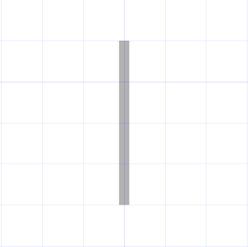
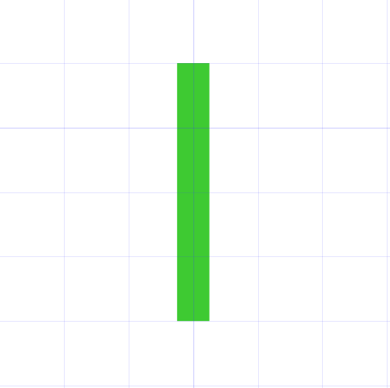
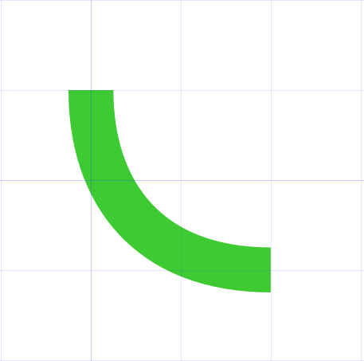
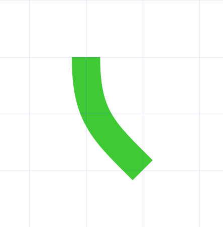
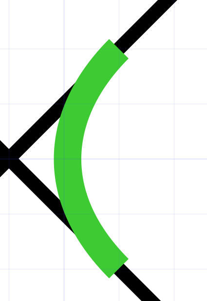
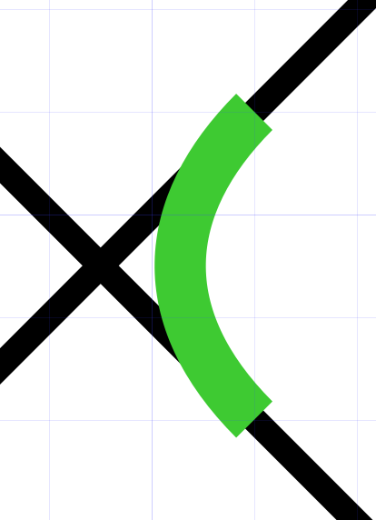
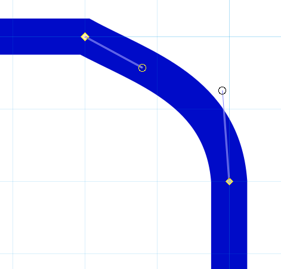
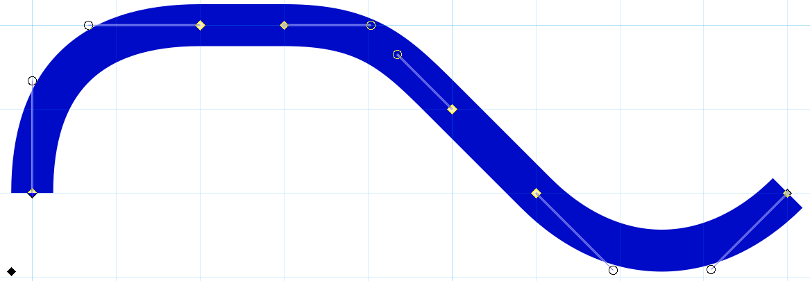

# ROS UK Project Map

This maps shows available community routes for Railway Operation Simulator within the United Kingdom. This project is open for contributions, but please read the below section carefully to ensure that you follow the same formatting etc.

## Guide to Contributing

In the project there are two main files:

- `map/ROSProjects.svg`
- `data/project-data.csv`

### Map Features

The map should contain all National Rail routes which have a consistent service. Consistant service means any route that has a regular scheduled passenger service. This excludes routes that are used by freight services, and those used by a few passenger services in the day or week. However, routes which have a limited service, but have stations on them, such as the Brigg Line in Lincolnshire, should be mapped. If in doubt, ask in the RailOS Discord.

Not all stations need to be included in the map - preference should be given to major stations. Other stations to be included should be:

- Stations near railway junctions, despite their relative quietness. (See Clarbeston Road, Craven Arms, Romsey)
- Stations that are well known. (See Pilning)

**Terminus stations should always be included.**

### Mapping

The map data is contained within `ROSProjects.svg`. It was created in [Inkscape](https://inkscape.org/) and this tool is the best to continue with mapping.

The map is built on to a `1mm` by `1mm` grid, with the origin being `x = 0` and `y = 0`. Some exceptions apply to this with diagonal `90` degree turns and double point stations.

Lines are created using the Bezier path tool.

There are two different variants of lines used on the map:

**No Project Line**

This line is used where no RailOS project exists for the route.

- Width: `0.250mm`
- Colour: `b2b2b2ff`

**Project Line**

This line is used where there is at least one RailOS project covering the route.

- Width: `0.500mm`
- Colour: Different per project, chosen almost at random, though should avoid nearby colours.

**Curves**

The map is based on `45` and `90` degree turns as below:

An alternative `n by n` `90` degree turn can be used if required, though `2x2` is recommended.

If you are doing a `90` degree turn at a diagonal, two curves can be done:

Notice that the second of these curves has the centre at the intersection of the two diagonal lines as opposed to on the grid.

**Drawing a Line**

Several menus are useful to have open when editing the map:
- Align and Distribute (Ctrl + Shift + A)
- Fill and Stroke (Ctrl + Shift + F)
- Export (Ctrl + Shift + E)
These menus open on the right of the screen by default.

Where a line is already featured on the map, but a RailOS project now exists for it, the existing line can be altered:
- Select the line.
- Trim the line to the right length if required:
  - Using `Edit Paths by Nodes` (N), select the node at the end of the section required.

  - Click `Break Path at Selected Nodes`, then `Path -> Split Path`.
  - Repeat at the other end if required.
- In the `Fill and Stroke menu`, select the `Stroke Style` tab and adjust the width to `0.500mm`
- In the `Fill and Stroke menu`, select the `Stroke Paint` tab and adjust the colour as required.

Where the line isn't present on the map:
- Select the `Bezier Curve` (B) tool:

- Open the snapping menu (a left facing arrow from in the top right corner).
- Turn snapping on, and ensure `Grids` is selected.
- Draw the line by clicking to create nodes. A node should be present at each end, and either end of each corner. The lines are all straight for now - that will be fixed later. Double click for the last node to end the line.
- Disable `Grids` snapping in the snapping menu.
- Select `Edit Paths by Nodes` (N), and drag the diagonal section you want to be a curve slightly.

- Click a node at one end of the curve, and this should make two adjusting bars appear.

- Drag the circles at the ends of the adjustment bars to form the curve correctly. Holding Ctrl will snap them to the correct angles.

**Stations**

The easiest way to add a station is to copy a station *blob* from elsewhere (including the circle, dash, and text) in the correct orientation (perpendicular to the line) and paste it in, updating the text to the correct name.

Some stations have lines intersecting at several angles, in which case the orientation should be between the intersection angles. (See Stratford, Watford Junction)

When lines intersect at a station on both intersecting lines (See Worcestershire Parkway, Willesdon Junction), then a *blob* is put on both lines, and the *blobs* and the station name can be moved off the grid to make everything look straight.

Station names should not be over a line, but can be over the water if there is no other alternative. (See Weston-super-Mare)

**Route Names and Authors**

The route name and author text should be placed somewhere in the centre of the route, but not covering any lines or station texts. It should be the last thing to be added. This can also be done by copying another route name and author, updating the text as required. It should be the same colour as the route on the map.

### Project Data

The project data is in the `data/project-data.csv` file in a csv format. However, this format can be opened in Excel if preferred. It is currently very out of date, but may be updated in the future.

**Guide to Columns**

- Name

This is the name of the route, should be identical to the website.

- Tags

These are the tags for the project as extracted from the website, these tags should contain the name of the author. If the project was added after the extraction, only the author will be in that column as it was added manually.

- Added to map?

The values for this column can be:

TRUE: The route is added to the map, and the route name and author text has been added.

WIP: The route is in the process of being added to the map.

FALSE: The route has not been added.

- Link

This is a link **directly to the image** on the website. Having these direct links speeds up the need to search for the route and find the image on the website. This can be updated by getting the URL of the image directly.

- Notes

Notes can be inserted here about the routes. The `-` note does not mean anything and is simply there to cut off the previous line. London Underground routes are shown as `LUL` as they may be mapped seperately at a later time, but not on this map.